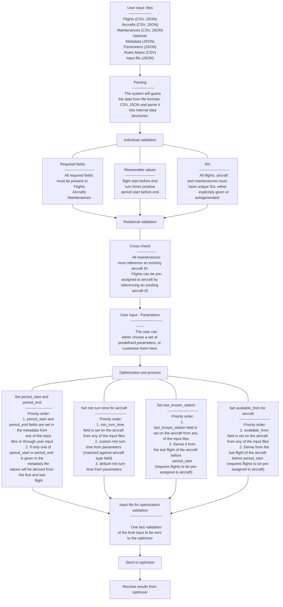

# Django Backend
This is the backend of the project, built using Django. It serves as the API for the frontend and handles all the business logic and database interactions.

## Run

Install the required packages:
```bash
pip install -r requirements.txt
```

Migrate the database and create adminuser and guest users:
```bash
python manage.py db_init
```

Run the Django server:
```bash
python manage.py runserver
```

# System Overview



## Create opt run
1. Copy opt run - create a new opt run with the current input file. Possible to update it, or params

## Schemas

File tree:
```
opt/
├── schemas/
│   ├── loader.py                  # Loader logic for version dispatching
│   │
│   ├── components/
│   │   ├── activities/
│   │   │   ├── __init__.py
│   │   │   ├── v1.py              # Activities V1 schemas
│   │   │   ├── v2.py              # Activities V2 schemas
│   │   │   └── tests/
│   │   │       ├── __init__.py
│   │   │       ├── test_v1.py
│   │   │       └── test_v2.py
│   │   │
│   │   ├── resources/
│   │   │   ├── __init__.py
│   │   │   ├── v1.py              # Resources V1 schemas
│   │   │   └── tests/
│   │   │       ├── __init__.py
│   │   │       └── test_v1.py
│   │
│   └── optinput/
│       ├── __init__.py
│       ├── v1.py                  # OptInputV1 + InputBuilderV1 (includes constraints)
│       ├── v2.py                  # OptInputV2 + InputBuilderV2 (includes constraints)
│       ├── v3.py                  # OptInputV3 + InputBuilderV3 (includes constraints)
│       └── tests/
│           ├── __init__.py
│           ├── test_v1.py
│           ├── test_v2.py
│           └── test_v3.py
```